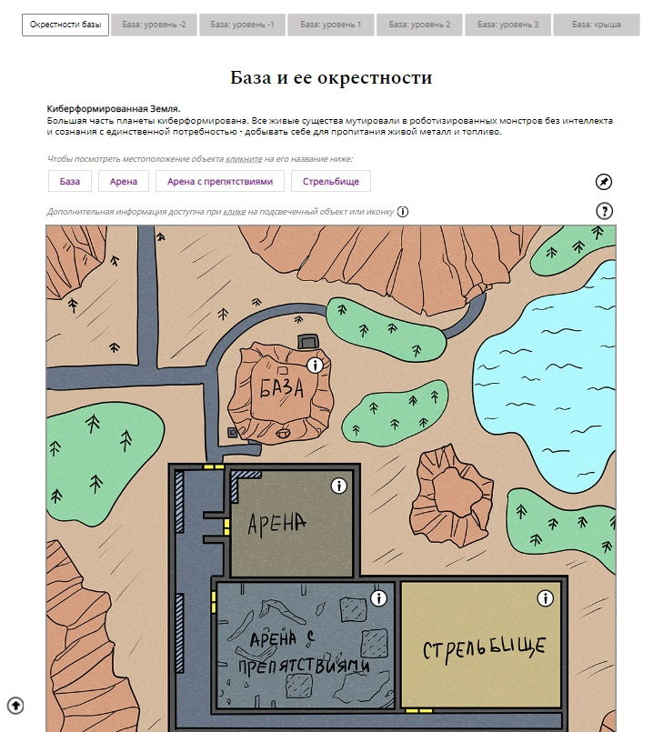
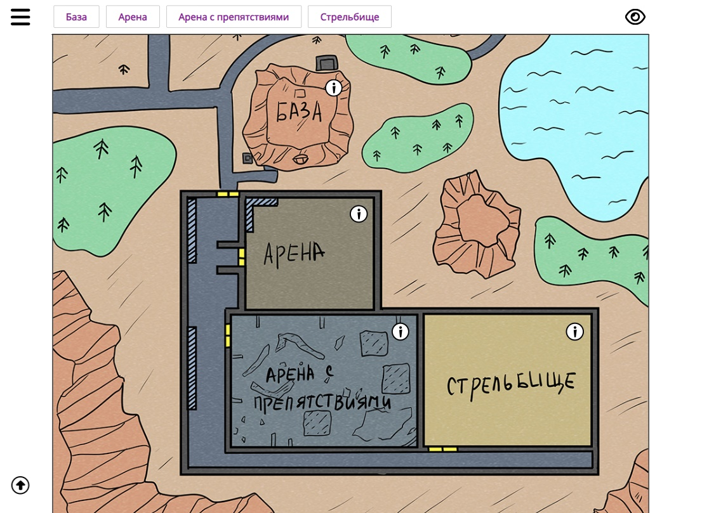
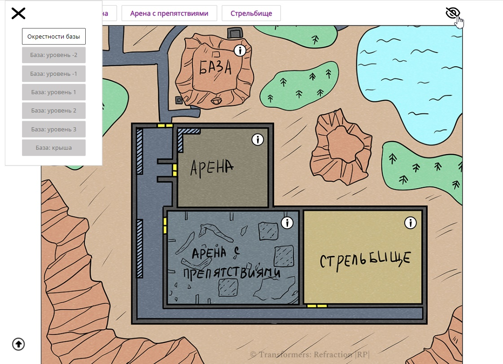
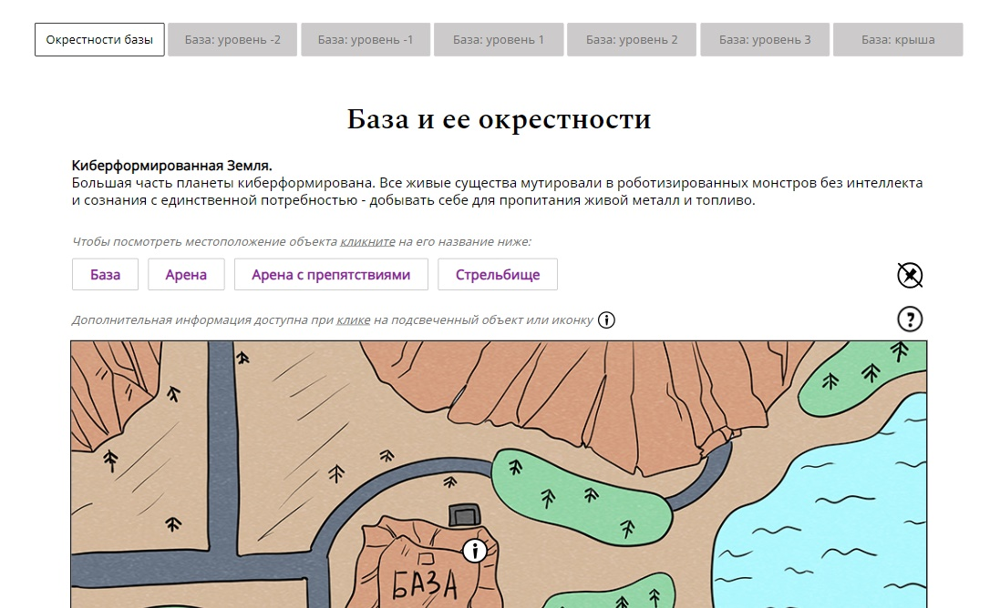

#  Информационный сайт по размещению локаций текстовой ролевой игры (HTML | CSS | JS)

[Переключиться на английский | Switch to English](./readme.md)

## О проекте
Сайт включает основную информацию о местоположении объектов в рамках ролевого мира.

**Инструменты:** 

**Языки:** 
 
 
 

**Демо:** [Перейти на сайт](https://the-all-spark.github.io/rp_location_schemes/)  

## Реализованный функционал:
1. _основное меню_: навигация по страницам сайта - уровням базы;
2. _дополнительное меню_ в виде "прилипающей" панели (перечислены основные объекты на текущей странице). Когда панель "прилипает":
    - появляется иконка глаза:
      - при наведении на иконку глаза она меняется на перечеркнутый глаз;
      - при клике на перечеркнутый глаз панель с объектами "отлипает" (иконка с кнопкой напротив списка объектов становится перечеркнутой).
    - появляется иконка бургер-меню:
      - при клике на иконку открывается меню, дублирующее основное меню страницы; иконка меняется на крестик;
      - при клике на крестик меню закрывается.
3. При клике на иконку перечеркнутой кнопки панель снова "прилипает" и при прокручивании страницы вниз отображается вверху;
4. При клике на иконку вопроса отображается _изображение с условными знаками_ для текущей страницы; иконка меняется на крестик. При повторном клике на иконку изображение закрывается.
5. При клике на объект (в списке объектов или когда панель закреплена) он выделяется; страница прокручивается прямо к объекту (величина смещения рассчитывается с учетом того, закреплена панель или нет);
6. При наведении на объект он подсвечивается (для мобильных устройств объект, у которого имеется информация, дополнительно отмечен иконкой "i");
7. При клике на объект:
    - он выделяется бордовой рамкой/контуром; 
    - скрывается иконка "i";
    - отображается _блок с информацией_ об объекте.
8. Повторный клик на объекте убирает выделение рамкой/контуром, отображает иконку "i", скрывает блок с информацией;
9. При клике на иконку _"Стрелка" (Вверх)_ страница плавно прокручивается к главному меню. 

## Демонстрация функционала
"Прилипание" панели с объектами  
  
Открытое бургер-меню и эффект при наведении на иконку "Скрыть панель"  
  
Панель не закреплена. Иконка кнопки поменялась на перечеркнутую    
  
Подсвечивание объекта и прокручивание страницы (на примере базы)  
  
Отображение информации об объекте (на примере базы)  
  
Изображение с условными знаками для текущей страницы   
