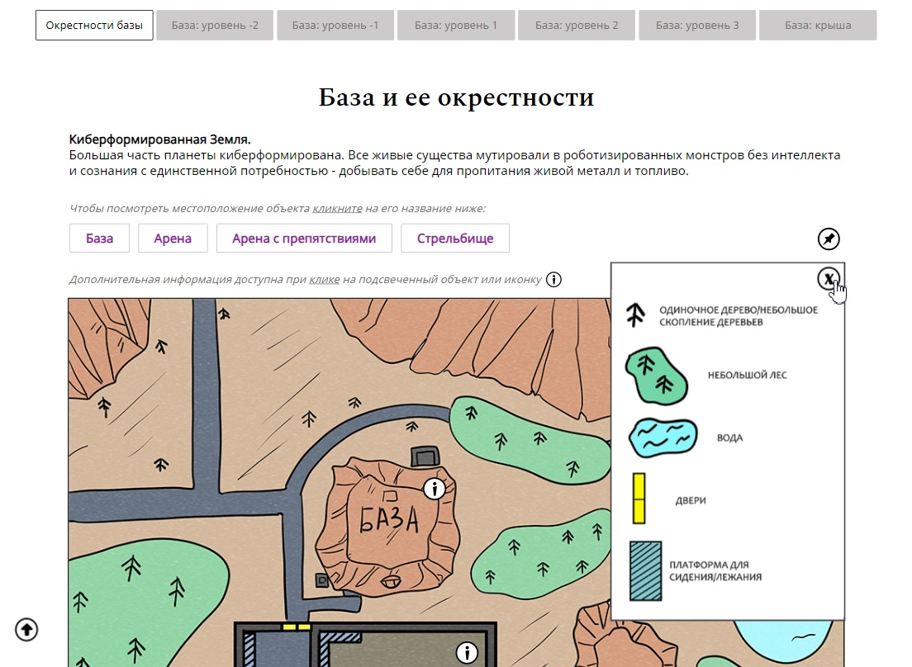

#  Pole playing location schemes info site (HTML | CSS | JS)

[Switch to Russian | Переключиться на русский](./readme-ru.md)

## About the project
The site includes basic information about the location of objects within the role-playing world.

**Tools:** 

**Stack:** 
 
 
 

**Демо:** [Перейти на сайт](https://the-all-spark.github.io/rp_location_schemes/)  

## Realized functionality:
1. _main menu_: navigation through the pages of the site - base levels;
2. _additional menu_ in the form of a “sticking” panel (the main objects on the current page are listed). When the panel “sticks”:
    - the eye icon appears:
      - when hovering over the eye icon, it changes to the crossed-out eye icon;
      - when clicking on the crossed-out eye, the panel with objects “sticks” (the pin icon opposite the list of objects becomes crossed out).
    - the burger menu icon appears:
      - when clicking on the icon the menu that duplicates the main menu of the page opens; the icon changes to a cross;
      - when clicking on the cross the menu closes.
3. When clicking on the crossed-out pin icon, the panel “sticks” again and is displayed at the top when scrolling down the page;
4. When clicking on the question icon the _image with conditional signs_ for the current page displays; the icon changes to a cross. When the icon is clicked again, the image closes.
5. When clicking on an object (in the object list or when the panel is pinned), it is highlighted; the page scrolls directly to the object (the amount of offset is calculated based on whether the panel is pinned or not);
6. When hovering over an object, it is highlighted (for mobile devices, the object that has information is additionally marked with an “i” icon);
7. When clicking on an object:
    - it is highlighted with a maroon frame/outline; 
    - the “i” icon is hidden;
    - a _block with information_ about the object is displayed.
8. Clicking on the object again removes the selection by the frame/outline, displays the “i” icon, hides the block with information;
9. Clicking on the _“Arrow” (Up)_ icon scrolls the page smoothly to the main menu. 
10. Responsive layout.

## Functional demonstration  
|      Description |   Screenshot   | 
|------------------|----------------|
|“Sticking” of the panel with objects |  |
| Opened burger menu and the effect when hovering over the “Hide Panel” icon  |  |
| The panel is not pinned. The pin icon has changed to a crossed out icon. |   |
| Object highlighting and page scrolling (on the example of the base) |  |
| Displaying information about an object (on the example of the base) |   
| Conditional sign image for the current page |  |